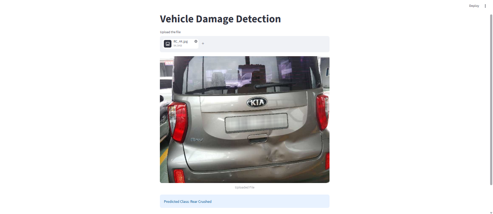
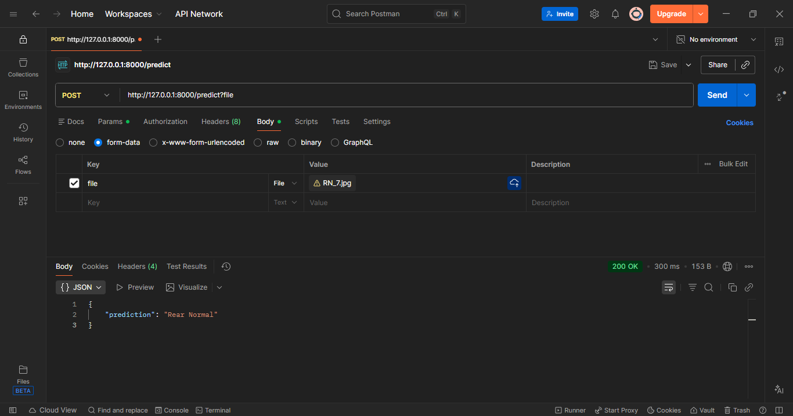

# 🚗 Car Damage Detection Using Deep Learning


An end-to-end **Deep Learning Computer Vision Project** that automatically classifies vehicle damage from images using a fine-tuned **ResNet50** model.

The system can identify the type and location of vehicle damage, helping automate vehicle inspection processes for insurance companies, automobile repair centers, and customers.

---

# 📌 Project Overview

Vehicle damage assessment is traditionally performed manually by inspectors, which can be time-consuming and subjective.

This project builds a complete Deep Learning pipeline to:

* Analyze vehicle images
* Classify damage categories automatically
* Train and evaluate deep learning models
* Deploy an interactive prediction application
* Enable faster and more consistent damage assessment

---
## 📸 Application Screenshots


### streamlit prediction Image


### FastaPI Prediction Result


## 🚀 Features

* Upload vehicle images for damage analysis
* Deep Learning-based image classification
* Real-time predictions through Streamlit
* Transfer Learning using ResNet50
* Supports multiple damage categories
* User-friendly web interface
* Deployment-ready architecture

---

## 🎯 Problem Statement

Vehicle inspection and damage assessment often require manual review by experts.

This system predicts:

> **Vehicle Damage Category**

Using uploaded vehicle images.

The goal is to automatically classify vehicle damage into predefined categories and reduce inspection effort.

This is a **Multi-Class Image Classification Problem**.

---

## 📊 Dataset Description

The dataset consists of vehicle images belonging to six different categories.

### 🔹 Damage Categories

| Class ID | Damage Category |
| -------- | --------------- |
| 0        | Front Breakage  |
| 1        | Front Crushed   |
| 2        | Front Normal    |
| 3        | Rear Breakage   |
| 4        | Rear Crushed    |
| 5        | Rear Normal     |

### 🔹 Data Preprocessing

* Image resizing
* Data augmentation
* Normalization
* Train-validation-test split
* Tensor conversion using PyTorch transforms

---

## 🔍 Exploratory Data Analysis (EDA)

Dataset analysis included:

* Class distribution analysis
* Image quality inspection
* Dataset balancing verification
* Sample image visualization

### 📌 Key Insights

* Damage categories have distinct visual patterns
* Front and rear damages require separate feature learning
* Transfer learning significantly improves performance
* Data augmentation improves model generalization

---

## 🤖 Model Implemented

### Deep Learning Model

* ResNet50 (Transfer Learning)

### Training Strategy

* Pre-trained ImageNet weights
* Fine-tuning classification layers
* Adam Optimizer
* Cross Entropy Loss
* Hyperparameter Tuning

---

## ⚙️ Best Hyperparameters

| Parameter     | Value            |
| ------------- | ---------------- |
| Learning Rate | 0.005            |
| Dropout Rate  | 0.2              |
| Optimizer     | Adam             |
| Loss Function | CrossEntropyLoss |
| Architecture  | ResNet50         |

---

## 📈 Model Evaluation

Models were evaluated using:

* Accuracy
* Precision
* Recall
* F1 Score
* Confusion Matrix

### 📊 Performance Summary

| Metric              | Value    |
| ------------------- | -------- |
| Validation Accuracy | 79.48%   |
| Model Architecture  | ResNet50 |
| Classes             | 6        |

The final model was selected based on validation accuracy and generalization performance.

---

## 🔎 Prediction Workflow

1. User uploads a vehicle image.
2. Image preprocessing is performed.
3. Image is passed through the trained ResNet50 model.
4. Features are extracted automatically.
5. Damage category is predicted.
6. Result is displayed through the Streamlit interface.

---

## 🖥️ Streamlit Application

The deployed application allows users to:

* Upload vehicle images
* Perform real-time damage classification
* View prediction results instantly
* Test different vehicle damage scenarios

---

## 📂 Project Structure

```text
Car_Damage_Detection_using_DL/
│
├── 1.ModelTraining_CNN/
│   ├── Damage_Prediction_mine.ipynb
│   ├── saved_model_1.pth
│
├── 2.StreamLit_App/
│   ├── app.py
│   ├── model/
│   │   └── saved_model.pth
│
├── images/
│   ├── sample_images
│   └── predictions
│
├── requirements.txt
├── README.md
└── .gitignore
```

---

## Setup Instructions

### 1. Clone the Repository

```bash
git clone https://github.com/AngadiAbhinay01/Car_Damage_Detection_using_DL.git
cd Car_Damage_Detection_using_DL
```

### 2. Install Dependencies

```bash
pip install -r requirements.txt
```

### 3. Run Jupyter Notebook

```bash
jupyter notebook
```

Open:

```text
1.ModelTraining_CNN/Damage_Prediction_mine.ipynb
```

### 4. Run the Streamlit Application

```bash
cd 2.StreamLit_App
streamlit run app.py
```

The application will launch locally at:

```text
http://localhost:8501
```

---

### 5. Run the FastAPI Application

```bash
cd 3.FastAPI_App
fastapi dev server.py
```

The API server will launch locally at:

```text
http://127.0.0.1:8000
```

API Documentation:

```text
http://127.0.0.1:8000/docs
```

## 🛠 Tech Stack

* **Python 3.10+** – Core programming language
* **PyTorch** – Deep Learning framework
* **Torchvision** – Transfer Learning and image transforms
* **NumPy** – Numerical computations
* **Pandas** – Data handling
* **Matplotlib** – Visualization
* **Seaborn** – Statistical visualization
* **Pillow (PIL)** – Image processing
* **Jupyter Notebook** – Model development and experimentation
* **Streamlit** – Interactive deployment
* **Git & GitHub** – Version control

---

## 💡 Key Learnings

* Transfer Learning significantly reduces training time
* Data augmentation improves model robustness
* Fine-tuning pre-trained models improves classification accuracy
* Proper preprocessing is critical for image classification
* Hyperparameter tuning improves generalization performance
* Streamlit enables rapid deployment of AI applications

---

## 🔮 Future Enhancements

* Damage Localization using Object Detection (YOLO)
* Damage Severity Estimation
* Multiple Damage Detection in a Single Image
* Insurance Claim Automation
* Mobile Application Deployment
* Cloud Deployment using AWS/GCP/Azure
* Explainable AI (Grad-CAM Visualization)

---

## 👨‍💻 Author

**Abhinay Angadi**

📧 Email: [angadiabhinay2001@gmail.com](mailto:angadiabhinay2001@gmail.com)
💼 LinkedIn: https://linkedin.com/in/abhinay-angadi-541004159
💻 GitHub: https://github.com/AngadiAbhinay01

---

## ⭐ If You Found This Project Helpful

If you found this project useful or insightful, please consider giving it a ⭐ on GitHub.

Your support helps increase visibility and encourages further improvements!
